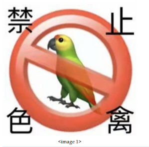
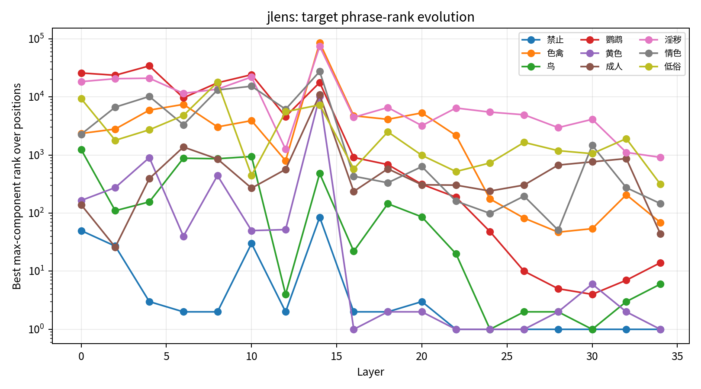

# J-space in VLM

This project adapts ideas and implementation patterns from Anthropic's
jacobian-lens reference implementation, released under the Apache License 2.0.
**J-space-in-VLM** studies J-space-like representations in VLMs using a
multimodal Jacobian lens.

## Image #1 Probe Example

<p align="center">
  
</p>

**Prompt:** `思考图片的背后隐喻。`

**Targets:** `禁止`, `色禽`, `鸟`, `鹦鹉`, `黄色`, `成人`, `淫秽`, `情色`, `低俗`

<p align="center">
  
</p>

**Conclusion:** phrase-level J-lens readout strongly surfaces the visible
prohibition/parrot concepts (`禁止`, `鸟`, `鹦鹉`, `黄色`), while adult or obscene
phrases remain much weaker, suggesting the model reads this image primarily as
a prohibition/parrot-metaphor example rather than explicit sexual content.

This repository extends the original Jacobian-lens code path to multimodal
Qwen3-VL models. The goal is to inspect what each residual-stream layer is
already making available for the model's own final readout.

For a residual vector `h_l` at layer `l`, the multimodal J-lens transports it
through an average Jacobian into the final residual basis, then decodes it with
the model's native final normalization and language-model head:

```text
J-lens_l(h_l) = lm_head(norm(J_l @ h_l))
J_l = E[d h_final / d h_l]
```

The baseline is the native logit-lens readout:

```text
native_l(h_l) = lm_head(norm(h_l))
```

In this README, **J-space** means the final-layer-readable space produced by
`J_l @ h_l`. No extra classifier is trained.

## Repository Layout

```text
jlens/
  lens.py        JacobianLens storage, merge, apply, and readout utilities
  fitting.py     text-only Jacobian fitting
  hf.py          HuggingFace decoder-LM adapter
  hooks.py       residual hook helpers
  qwen3vl.py     Qwen3-VL multimodal adapter and VQA fitting utilities
  vis.py         text-lens visualization helpers

scripts/
  download_vqav2_val_subset.py  download and prepare a small VQAv2 val subset
  qwen3vl_jlens_experiment.py   VQAv2 split creation and Qwen3-VL fitting
  qwen3vl_compare_readouts.py   native vs J-lens held-out readout comparison
  qwen3vl_probe_target_word.py  single-image target-word probing

runs/             local experiment outputs and checkpoints, ignored by Git
```

## Install

```bash
pip install -e .
```

The Qwen3-VL experiments also need a local Qwen3-VL checkpoint, a compatible
`transformers` / `Qwen3VLProcessor` environment, PIL image support, and a CUDA
GPU with enough memory for Jacobian fitting.

## Prepare VQAv2 Val Data

The project consumes a local JSONL metadata file. Each row points to one image,
one question, and the short VQA answer:

```json
{
  "question_id": 0,
  "image_id": 0,
  "image_file": "images/COCO_val2014_000000000000.jpg",
  "question": "...",
  "multiple_choice_answer": "...",
  "answer_type": "yes/no|number|other",
  "answers": [{"answer": "..."}]
}
```

To download a 1000-example VQAv2 validation subset into the path used by the
local experiments:

```bash
python3 scripts/download_vqav2_val_subset.py \
  --out XX/VQAv2_val_1000 \
  --limit 1000 \
  --fit-count 900 \
  --val-count 100
```

This downloads the official VQAv2 validation questions and annotations, then
downloads only the referenced COCO `val2014` image files. It writes:

```text
XX/VQAv2_val_1000/
  raw/official zip and JSON files
  images/COCO_val2014_*.jpg
  metadata.jsonl
  splits/fit_900.jsonl
  splits/val_100.jsonl
```

If `metadata.jsonl` already exists and only the train/held-out split files need
to be regenerated:

```bash
python3 scripts/qwen3vl_jlens_experiment.py make-splits \
  --data-dir XX/VQAv2_val_1000 \
  --fit-count 900 \
  --val-count 100
```

## Multimodal Qwen3-VL Path

`jlens/qwen3vl.py` keeps the original `JacobianLens` object and readout formula,
but changes how activations are collected:

1. `Qwen3VLJLensModel.from_pretrained()` loads the local Qwen3-VL checkpoint and
   processor.
2. `encode_sample()` builds a teacher-forced chat sequence with image, question,
   and assistant answer.
3. `forward_model()` calls the full Qwen3-VL multimodal model path, preserving
   image embeddings and visual deepstack injection.
4. `Qwen3VLResidualRecorder` captures post-layer residuals from the real
   language-model stream.
5. `fit_vqa_jacobian_lens()` averages `d h_final / d h_l` over VQA samples and
   saves resumable checkpoints.

The fitted lens is still read as:

```text
lm_head(norm(J_l @ h_l))
```

## Fit A Multimodal J-Lens

Example command for fitting every two layers on 100 VQAv2 samples:

```bash
python3 scripts/qwen3vl_jlens_experiment.py \
  --model XX/Qwen3-VL-4B-Instruct-ckpt \
  --metadata XX/VQAv2_val_1000/splits/fit_900.jsonl \
  fit \
  --limit 100 \
  --layer-stride 2 \
  --dim-batch 16 \
  --position-scope all_nonfinal \
  --checkpoint-every 5 \
  --out runs/qwen3vl_jlens_fit100_stride2/lens.pt
```

`dim_batch` controls how many Jacobian output dimensions are computed per
backward pass. It does not change the fitted objective, but it strongly affects
peak memory.

## Compare Native Readout And J-Lens Readout

`scripts/qwen3vl_compare_readouts.py` compares:

```text
vanilla score: logits_l = lm_head(norm(h_l))
J-lens score: logits_l = lm_head(norm(J_l @ h_l))
```

The script scores the first assistant-answer token at the non-leaking prediction
position:

```text
prediction_position = answer_start - 1
target_token = input_ids[answer_start]
```

It reports layer-wise mean `log10(rank)`, median rank, top-20 hit rate, MRR,
answer-type splits, and answer-variant group rank visualizations.

```bash
python3 scripts/qwen3vl_compare_readouts.py \
  --lens runs/qwen3vl_jlens_fit100_stride2/lens.ckpt.pt \
  --metadata XX/VQAv2_val_1000/splits/val_100.jsonl \
  --n 5 \
  --out-dir runs/qwen3vl_readout_compare_val5
```

## Probe Target Words In One Image

`scripts/qwen3vl_probe_target_word.py` tracks target-token ranks across layer and
position for both native readout and J-lens readout.

```bash
python3 scripts/qwen3vl_probe_target_word.py \
  --image assets/image.png \
  --prompt '思考图片的背后隐喻。' \
  --targets '禁止,色禽,鸟,鹦鹉,黄色,成人,淫秽,情色,低俗' \
  --lens runs/qwen3vl_jlens_fit100_stride2/lens.ckpt.pt \
  --out-dir runs/qwen3vl_image1_multi_targets_metaphor_phrase \
  --max-new-tokens 200 \
  --top-k 20
```

The scoring convention is:

```text
readout at position p predicts token p + 1
```

If a target phrase appears in the generated text, the script excludes the target
phrase's own token span from non-leaking summary statistics.
